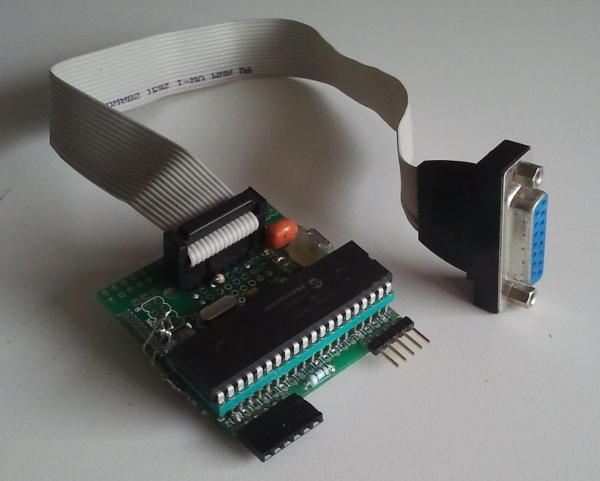
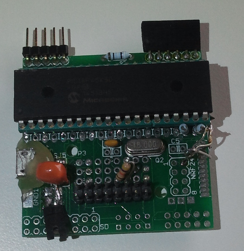

# Joystick port to usb conversion using JAL

 
**note** this has been written a while after the project was completed.  This most likely contains a few mistakes.

## Introduction

Converting an old racing wheel and paddles with an old joystick plug to a standard USB interface. No drivers needed!
Thanks to the easy USB-libraries of Matthew Schinkel, and the joystick pioneering of HelmPCB, this was very easy!

### Some Notes
- The analog channels are read with a simple voltage divider using the 10 bit ADC, then they are internally linearized to 8 bit values
- The resistor values were chosen based on the stationary resistance of my particular joystick. Consider changing them with a different joystick
- It was needed to connect more than one ground of the joystick
- With QuickPIC v0.1 the usb connector is placed a bit off the board, therefor  some hot glue was needed to support the connector. This is solved in v0.2
- There was no readily availabele bootloader for the 45k50, so a PICkit was directly connected to the board (QPv0.1 has swapped Vdd & GND!) **Remember** to disconnect the USB-serial bridge, to prevent the high programming voltage reaching the module, through the reset pin (DTR).
- The interal 16MHz oscilator is used

### The software steps

- Get the usb-keyboard demo of Albert Faber (blog_part3.jal), from the jallib package
- Create an appropriate HID-report-descriptor using the instructions on [HelmPCB](http://helmpcb.com/electronics/usb-joystick). The result is [Joystk.txt](Joystk.txt) . (A [mirror](dt2_4.zip) of the software)
- Add the descriptor into the keyboard examples, 
  - adjust the length of the data sent
  - Clear the keyboard interface class 
- Change the name of the device. If somehow the devices already was installed one time under the same name, but as a keyboard, you have to uninstall for it to be recognized as a joystick
- In the main loop, construct the HID-data-package, according to your specification (from [joystk.txt](joystk.txt)).
- Calibrate the joystick by running joy.cpl from your runbox (it is still there in Windows 7)
- Enjoy!

You can find all code changes made to the example in [Changes.html](Changes.html)

### More images
See the [Images](Images/) folder for more images of the converter.

